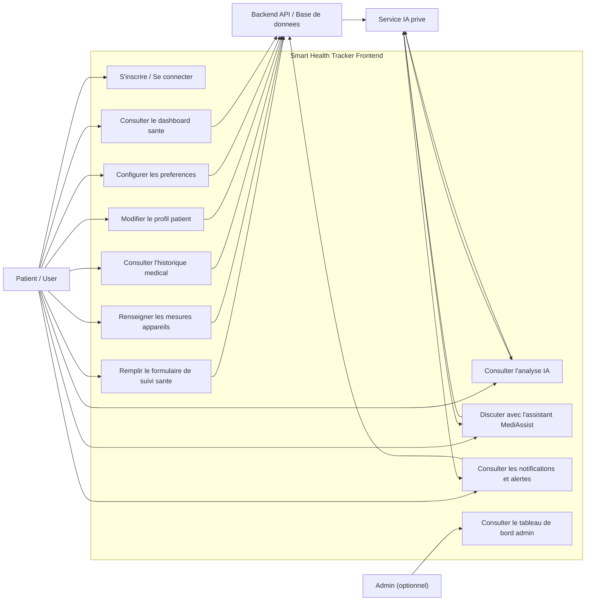

# Smart Health Tracker - Diagramme de cas d'utilisation global

## Acteurs

- **Patient / User** : utilisateur principal de l'application. Il saisit ses donnees, consulte son suivi, ses alertes, son profil et les recommandations IA.
- **Admin** : role optionnel et isole. Il sert uniquement au monitoring global de la plateforme.
- **Backend API / Base de donnees** : couche future qui stockera les donnees patient et exposera les endpoints necessaires au frontend.
- **Service IA prive** : service externe/interne appele via API. Ce n'est pas un role utilisateur.

## Cas d'utilisation principaux

- Authentification : inscription, connexion classique, preparation OAuth Google/Apple.
- Dashboard : consultation des indicateurs, charts, alertes et resume IA.
- Formulaire sante : saisie des donnees personnelles, mesures appareils, antecedents, traitements, symptomes et mode de vie.
- Analyse IA : generation de recommandations personnalisees a partir des donnees patient.
- Notifications : affichage des alertes, filtres, details et marquage comme lu.
- Profil : edition des informations patient et photo de profil.
- Settings : configuration des preferences frontend.
- Admin : supervision optionnelle.

## Regles metier importantes

- L'application ne contient pas de role docteur/praticien.
- Les seuls roles applicatifs sont **Patient/User** et **Admin optionnel**.
- L'IA est un service/API prive, pas un utilisateur.
- Le MVP actuel est frontend-only avec mocks, mais les contrats backend sont documentes dans `docs/api-contracts.md`.
